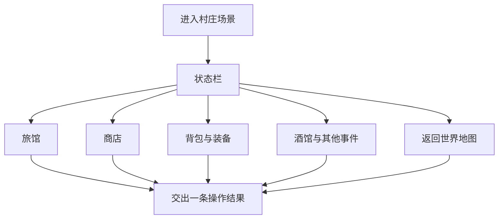
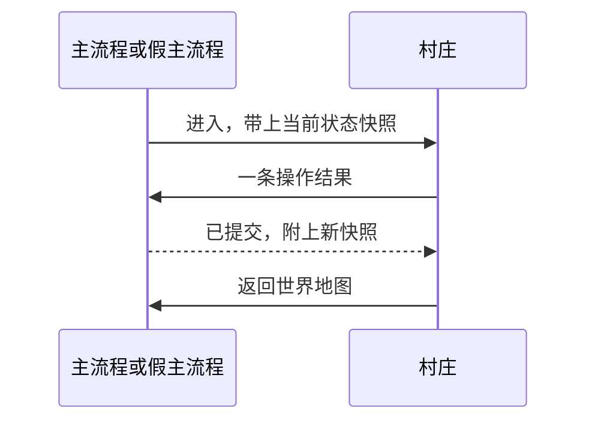

# 村庄与事件（M4 / 工作包 D）

依据：

- [七宗罪项目架构_v0.7.docx](七宗罪项目架构_v0.7.docx)
- [村庄.jpg](村庄.jpg)（功能流程）
- [reference/9f988f1526906ad84077799bc9f2df34.png](reference/9f988f1526906ad84077799bc9f2df34.png)（村庄画面）

这块是主地图上的村庄节点，单独做成场景 `Village`。自己能进 Play 做完购买、事件、旅馆。接回主流程时只加一次跳转：主流程进入村庄，村庄点「返回世界地图」回去。村庄不改地图结构、不写存档、不推进别人的关卡。

架构比流程图优先。两边不一致的地方见文末「待确认」。

## 负责范围

| 做 | 不做 |
|---|---|
| 村庄场景、状态栏、旅馆、商店、背包与装备、酒馆及其他事件地点 | 大地图生成、节点解锁、层数推进 |
| 校验操作，交出一条结果：资源变化、耗时、是否完成、后续遭遇 | 自己改世界时间、罪恶、原罪、地图连线 |
| 问号与事件的选项界面（内容已由主流程抽好） | 进界面时重新抽事件、重新补货 |
| 单独可玩的假主流程，用来签收这条结果 | 写 `latest.json`、手动存档、多槽、历史档 |
| | 战斗演算、Boss、结算页 |

工作包 D 的第一版演示：一次购买、一次事件、一次旅馆，三次都把资源和耗时交出去，而且只交一次。

## 玩家在村庄里能走的路

画面上目前可点的是三栋建筑和右上角「返回世界地图」。教堂、水井、墓地、菜地、路牌、断桥只是景色。断桥不能变成新道路，架构已取消运行中加边。以后配置里若出现新的事件地点，再加可点位置。

状态栏常驻，显示生命、提灯、罪骸、日期、事件提示。背包从状态栏进，不是一栋房子。

日期只显示，不自己计时。`T` 从 0 起，一天三个单位：早晨、下午、夜间。界面第 1 天早晨是 `T = 0`。显示用「第 `floor(T / 3) + 1` 天」加当前单位。

### 旅馆

- 确认后：生命与提灯回满，并带上耗时。
- 图上写的耗时是「推进至日终」。建议耗时为当前日剩余单位：早晨 3、下午 2、夜间 1。村庄只把这个数字放进结果，主流程逐单位结算。
- 回满只发生在这一次提交里。已经回满过，再次打开旅馆不再回满。
- 关闭面板不算完成，不提交。

另外两种休整架构保留，但这张图没有名字。它们以后走同一条结果，不另做一套提交。地图上的三处营地不是这个场景：离开营地由地图记探索完成，不扣休整次数。

### 商店

配置是 12 把武器、6 种道具，每件有稳定 ID、效果、价格、库存。

确认购买前检查三件事：罪骸够、库存大于 0、背包还有空位。任一不满足就提示失败，不提交。

通过后只提交一次：扣罪骸、扣库存、物品进包、列表刷新。处理期间按钮锁住。关掉商店再打开，不能把同一次购买再结算一遍。

### 背包与装备

- 四个装备槽。替换已有槽位时先弹出冲突确认。
- 使用道具时检查地点、剩余数量、耗时。只能在村庄用的道具，在别的地点不提交。
- 换装或用道具各算一条结果，交给主流程改库存。
- 和主地图上已有的背包按钮共用同一份库存。村庄不另建一份背包。村庄打开时，地图那个按钮点不到。

### 酒馆与其他事件

- 只打开主流程已经抽好的事件。打开面板、关闭面板、读档，都不重新抽取。
- 界面给出事件数量、期限、只读见闻，以及完整选项和风险提示。
- 选定一个选项才提交：资源变化、耗时、完成标记、后续遭遇。
- 没选就关掉：事件仍在，可以再来。
- 期限由主流程在时间推进时判过期。村庄只显示，不自己删事件。
- 问号节点人在地图上，内容界面用这一套。地图负责「从哪个节点打开」，村庄负责选项和结果。

### 返回世界地图

不改生命、物品、罪骸和时间。结果类型是「离开」，完成标记为否。村庄在架构里本来就是已完成节点，回去不会把地图层数加一，也不会把别的节点标成通过。

## 和主流程怎么接

主场景以后仍是流程入口。村庄用自己的场景和预制体，集成时只接下面这一个入口、一种结果。规则放在普通 C# 类里，界面只负责点和显示。

单独开发时，假主流程实现同一个入口：把结果应用到内存里的状态并刷新状态栏。不加载 `SampleScene`，不写文件。

进入时村庄只读这些数据：生命与上限、提灯与上限、罪骸、`T`、库存、四槽装备、当前武器、商店库存、本单位已抽好的事件、旅馆是否已经回满过、来源节点。缺的字段由假主流程补测试值。现有 `GameState` 还没有罪骸和事件列表，接入时由主流程放进快照，村庄不私自改 `GameRoot` 的字段定义。

每次提交只带这些字段：

| 字段 | 含义 |
|---|---|
| `actionId` | 这一次操作的 ID。同一次确认不会生成第二个 |
| `actionType` | `ShopBuy`、`RestInn`、`EventChoice`、`Equip`、`UseItem`、`LeaveToMap` |
| `sourceId` | 商品、事件、建筑或道具 ID |
| `optionId` | 事件选项。其他类型为空 |
| `resourceDeltas` | 生命、提灯、罪骸、物品增减、装备槽变化 |
| `timeCost` | 耗时单位。返回地图为 0 |
| `completed` | 这次算不算做完。关面板和返回地图都是否 |
| `followUp` | 后续遭遇或事件 ID。没有则为空 |

主流程（或假主流程）校验后才改状态。村庄收到「已提交」再刷新。提交按钮在回来之前保持锁定。关面板、重进界面、重复点击，都不会再执行已提交的选项。

村庄禁止做的事：

- 调用现在的 `MapController.OnNodeClicked`。那个函数会把节点标成通过，并可能把层数加一。
- 修改 `SampleScene` 里的节点布局。
- 增加或删除道路。
- 进入战斗演算。后续遭遇只交 ID。
- 写入日档。跨日保存是主流程的事：人还在局内，并且时间跨过日界，才由主流程写唯一日档。

## 单独做、以后跳进来

场景文件用 `Taptap_Demo/Assets/Scenes/Village.unity`。脚本放在 `Assets/Scripts/Village/`，配置用 ScriptableObject，放在 `Assets/Configs/Village/`。幕布按 1920×1080 设计，参考图铺满这块幕布（`Assets/Sprite/UI/VillageBackdrop.png`）。界面都摆在幕布里，屏幕比 16:9 更宽或更高时留边，不裁幕布。热点对旅馆、商店、酒馆和「返回世界地图」。

直接打开这个场景按 Play 就能测。没有主流程时，场景自己造一份测试状态。点「返回世界地图」只提示已经请求返回，人仍留在村庄，方便连续试商店和事件。

接到主流程时，主流程增加一处判断，村庄代码保持不动：

1. 节点 ID 是 `village`，或类型是村庄：加载 `Village`，把 `GameRoot` 里的状态交进去。`GameRoot` 已经 `DontDestroyOnLoad`，场景切换后还在。
2. 村庄交出「返回世界地图」：回到地图场景，用提交后的状态刷新。
3. 若以后改成叠在地图上的面板，而不是切场景：村庄界面挡住地图点击；关掉或返回后，地图恢复点击。结果对象和上面相同。

这样地图、战斗、存档的操作都不会在村庄打开时触发。

## 第一版怎样算做完

单独打开 `Village` 场景即可验收。

1. 买成一件商品：罪骸和库存下降，物品进包。再点一次不会再买。钱不够、卖光、包满时有失败提示，状态不变。
2. 选定一个事件：奖励和耗时只出现一次。关掉再开，不会再结算。没选就关掉，事件还在。
3. 住一次旅馆：生命和提灯回满，并带有耗时。再住一次不会再次回满。
4. 返回世界地图：资源、时间和完成记录都不变。
5. 上面任何操作都不产生存档文件，也不改变地图节点和层数。

## 待确认

1. [村庄.jpg](村庄.jpg) 里有「存档入口，保存当前村庄进度」。架构 v0.7 已删除手动存档和存档按钮，退出、关面板、当天任意时点都不新写进度档。本文不实现这个入口。若要加回，需要改架构。
2. 「推进至日终」的耗时，本文暂按当前日剩余单位。若旅馆是固定耗时，改配置即可，提交方式不变。
3. 罪骸是流程图里的货币。架构正文没有单列这个字段，现有代码里也没有。接入前需主流程确认字段名和初始值。
4. 三种休整里，图上只有旅馆。另外两种的名称、耗时和恢复量等配置。
5. 四槽各槽装什么，等装备配置。冲突确认和只提交一次这两条先固定。
